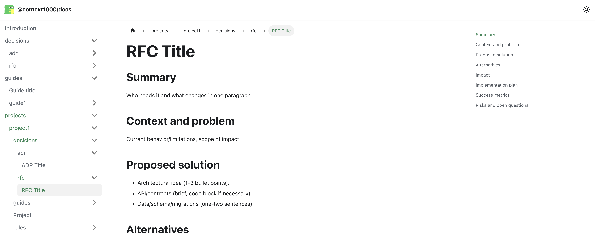
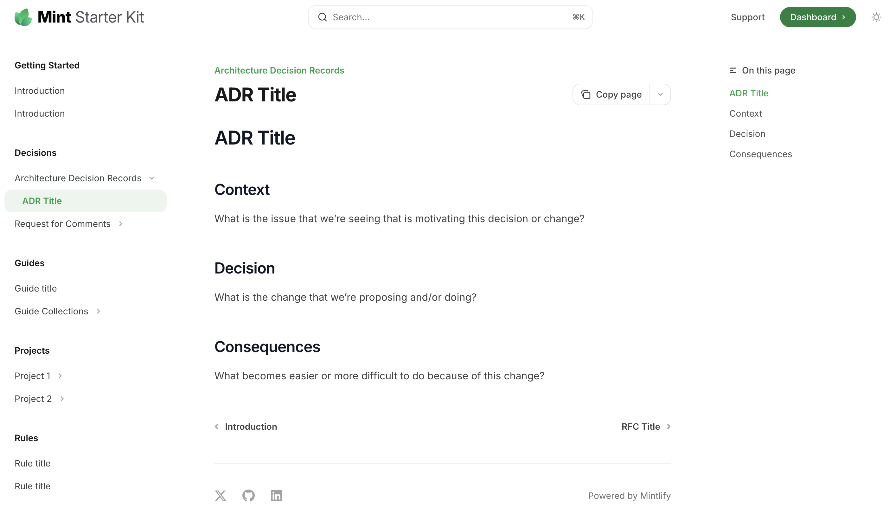

# context1000 templates

## Docusaurus



<a href="https://docusaurus.io/" target="_blank">Docusaurus</a> is an open-source tool from Meta (Facebook) for building documentation websites. [Check template here ](./docusaurus)

Run in terminal:

```sh
npx gitpick https://github.com/context1000/templates/tree/main/docusaurus my-cool-project
```

## Mintlify



Mintlify is a platform for creating modern, developer-friendly documentation sites with clean design and interactive features like API references. It focuses on speed, automation, and ease of use so teams can publish polished docs quickly. [Check template here ](./mintlify)

<a href="https://mintlify.com/" target="_blank">Docusaurus</a> is an open-source tool from Meta (Facebook) for building documentation websites.

Run in terminal:

```sh
npx gitpick https://github.com/context1000/templates/tree/main/mintlify my-cool-project
```

## Build your own

Raw markdown template here: <https://github.com/context1000/docs>

## PR are welcome!

If you create working template, please [open PR](https://github.com/context1000/templates/pulls) to add it to the list.

## More information

- [context1000 documentation format](https://github.com/context1000/docs)
- [RAG+MCP for self-hosted usage](https://github.com/context1000/context1000)
- [Blog post about context1000](https://www.ivklgn.blog/posts/context1000-architectural-artifacts-for-ai/)